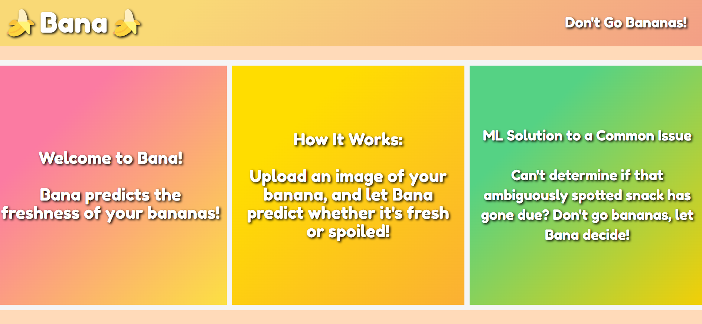
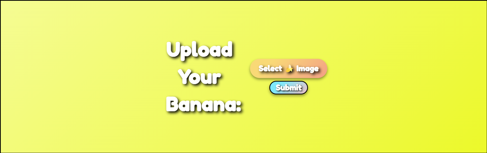
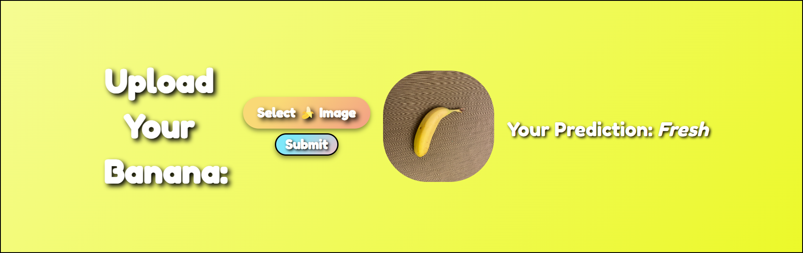
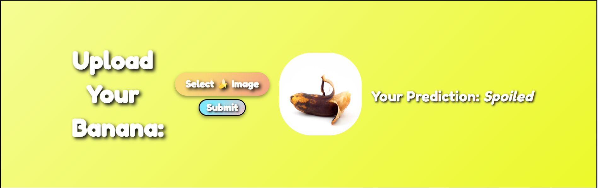

# Bana | Banana Freshness Classification App
Bana is a web application that answers your age old question: is this banana spoiled or not? Using a convolutional neural network, Bana classifies a banana as fresh or spoiled.

# Model Details
Images are resized to 224x224 and rescaled by dividing the image by 255. The batch size is 32. The train, validation, and test splits are 80%|10%|10%. The images are then augmented in order to provide a more robust dataset. The first convolutional layer contains 32 filters of size 3x3, and a ReLU activation function. The input shape includes the batch size (32), the image size (224x224), and the channels (3 RGB channels). Then, a max pooling layer is added with pool size of 2x2. Subsequently, 5 convolutional and max pooling layers are stacked; each convolutional layers has 64 filters of size 3x3 and an ReLU activation function, while each max pooling layer has a pool size of 2x2. After the fifth convolutional and pooling layers, the output of the final pooling layer is flattened. A dense layer of 64 units is added, and the final output layer of 2 units (fresh and spoiled classes) is added with a softmax activation function (which normalizes the probability of the classes). 

The model is compiled with an Adam optimizer, a sparse categorical cross entropy loss function (sparse because the classes are integers, not vectors), and accuracy is defined as the metric. The model is traied with 15 epochs. 

Used Python, Flask, TensorFlow, Keras, HTML, CSS, NumPy, Matplotlib

**Dataset Citation:**

**Pachon Suescun, Cesar Giovany; Pinzón Arenas, Javier Orlando; Jimenez, Robinson (2020), “Spoiled and fresh fruit inspection dataset”, Mendeley Data, V1, doi: 10.17632/6ps7gtp2wg.1**

 

 

 

